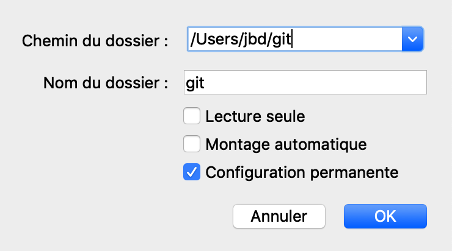

# Develop on Mac OS, build on linux through VirtualBox

On MacOS, the build fails (especially when building gcc which uses simultaneously `stamp.os` and `stamp.Os`) because MacOS _strangely_ use a case insensitive [file system](https://developer.apple.com/library/archive/documentation/FileManagement/Conceptual/APFS_Guide/FAQ/FAQ.html).

So, I use MacOS to develop using [Jetbrain](https://www.jetbrains.com/) product ([Webstorm](https://www.jetbrains.com/webstorm/) and [CLion](https://www.jetbrains.com/clion/)) and an up-to-date Ubuntu on [VirtualBox](https://www.virtualbox.org/).

Here is my setup for Ubuntu 18.10.

## Dependencies

Before installing the guest additions cd, we need to install some dependencies:

```
sudo apt update
sudo apt install openssh-server build-essential perl
```

Install Docker (based on https://github.com/docker/for-linux/issues/442)
```
sudo apt install apt-transport-https ca-certificates curl software-properties-common
curl -fsSL https://download.docker.com/linux/ubuntu/gpg | sudo apt-key add -
sudo apt-key fingerprint 0EBFCD88
sudo add-apt-repository "deb [arch=amd64] https://download.docker.com/linux/ubuntu bionic stable"
sudo apt update
sudo apt install docker-ce
```

Once done, you can install the `guest additions cd`.

## VirtualBox Shared folder


### Manual way

I share my `/home/jbd/git` folder with the VM.



You can either mount it manually

```
sudo mount -t vboxsf git ~/git/
```

or modify the `/etc/fstab` file to automatically mount it on start up.

Add this line:

```
/git    /home/jbd/git   vboxsf  defaults,uid=1000,gid=1000  0   0
```

Note that uid and gid values are numeric. If you are not the only user, you can discover those values using the `id` command
```
id -u
id -g
```


### VirtualBox auto-mount process

When auto-mounting the volume within the VirtualBox shared folder interface, the shared folder is available within `/media/_sf` + the folder name - in my case, it would be `/media/sf_git`.

Due to the default group used, The filesystem is in read-only, fix it using:
```
sudo usermod -a -G vboxsf $USER
```


## Build on linux

Once the development folder is set and shared between MacOS and Ubuntu, I use a second folder on Ubuntu to build. This one is not shared because of the case sensitive requirement.

Here is the script I use to simplify my build:

```
if [[ -z $ARCH ]]
then
	echo "ARCH is missing"
	exit 0
fi

source=/home/jbd/git/recalbox/recalbox/
target=/home/jbd/build/recalbox-$ARCH/

clear
rsync -av --progress $source $target --delete --exclude /output --exclude .idea --exclude /buildroot

cd $target
ARCH=$ARCH scripts/linux/recaldocker.sh
```

Usage: `ARCH=rpi ./build.sh`

## Helper

### sudo without passwd

`sudo visudo` and add `$USER ALL=(ALL) NOPASSWD: ALL` at the end, where `$USER` is yours.

